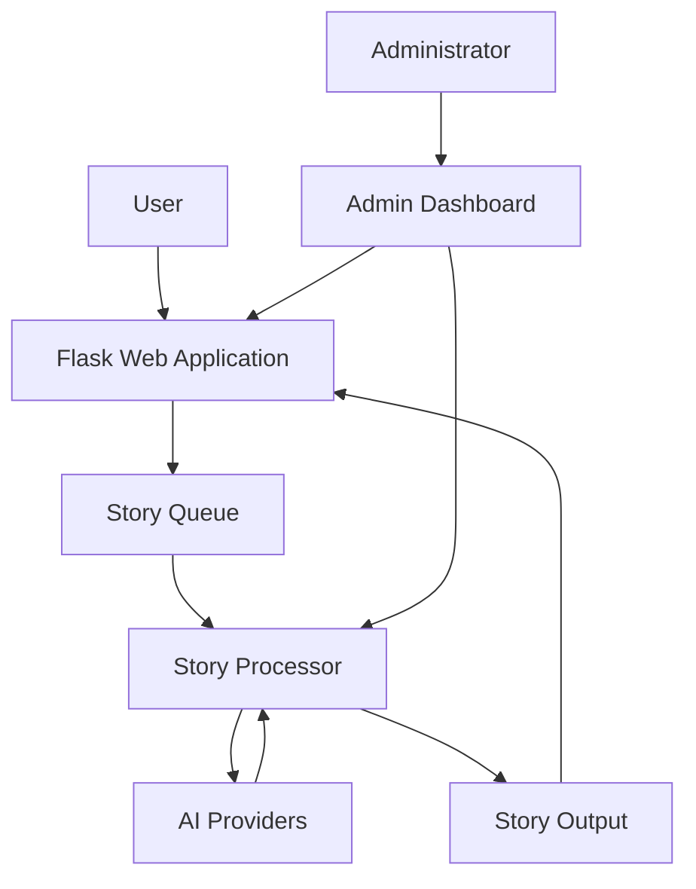
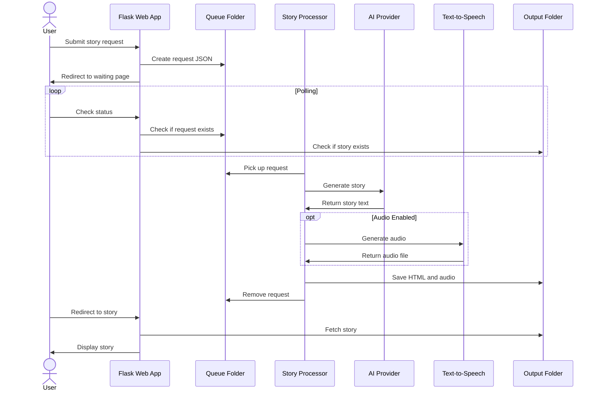

# System Patterns

## Architecture Overview

StoryMagic follows a modular architecture with clear separation of concerns between the web application, background processing, and administration components. The system is designed around a queue-based processing model to handle potentially long-running story generation tasks asynchronously.



## Core Components

### 1. Web Application (app.py)
- **Responsibility**: Handle HTTP requests, render templates, manage user sessions
- **Key Features**:
  - Story creation form handling
  - Story viewing and listing
  - Story rating system
  - Admin authentication
  - Static file serving

### 2. Story Processor (story_processor.py)
- **Responsibility**: Process story generation requests from the queue
- **Key Features**:
  - Continuous monitoring of the queue folder
  - AI provider integration via OpenRouter
  - Audio generation using OpenAI's TTS API
  - HTML formatting of generated stories
  - Error handling and logging

### 3. Admin Dashboard (admin/*)
- **Responsibility**: System monitoring and management
- **Key Features**:
  - Authentication and authorization
  - System status monitoring
  - Story management
  - Configuration management
  - Backup and restore functionality

### 4. Model Control Protocol (MCP)
- **Responsibility**: Define AI behavior and system configuration
- **Key Features**:
  - AI provider and model definitions
  - Theme and lesson definitions
  - System prompts and templates
  - Token length settings

## Data Flow

### Story Creation Flow
1. User submits story creation form
2. Web application validates input and creates a request JSON file
3. Request file is placed in the queue folder
4. User is redirected to waiting page that polls for completion
5. Story processor picks up the request from the queue
6. Processor generates story using selected AI provider via OpenRouter
7. If audio is requested, processor generates audio using OpenAI TTS
8. Processor formats story as HTML and saves to output folder
9. Processor updates request with completion info and moves to processed folder
10. Waiting page detects completion and redirects to story view



### Admin Dashboard Flow
1. Admin logs in with credentials
2. Admin is redirected to dashboard
3. Dashboard displays system status and statistics
4. Admin can perform various management actions
5. Actions are processed by the web application
6. Results are returned to the dashboard

## Design Patterns

### 1. Model-View-Controller (MVC)
- **Models**: JSON data structures for stories, configuration, etc.
- **Views**: Jinja2 templates for rendering HTML
- **Controllers**: Flask routes and admin blueprint

### 2. Queue-Based Processing
- Asynchronous processing of story generation requests
- File-based queue system using filesystem directories
- Status tracking through file movement between directories

### 3. Blueprint Pattern (Flask)
- Admin functionality encapsulated in a Flask Blueprint
- Modular organization of routes and functionality
- Clean separation of concerns

### 4. Factory Pattern
- Story generation factory based on selected AI provider
- Audio generation factory based on language and text length

### 5. Template Method Pattern
- Common story processing flow with provider-specific implementations
- Standardized error handling and logging

### 6. Observer Pattern
- Waiting page observes story generation status
- Polling mechanism for status updates

## File Organization

```
story2/
├── app.py                  # Main Flask application
├── story_processor.py      # Background processor
├── child_storyteller_mcp.json  # Model Control Protocol
├── config.ini              # Configuration file
├── .env                    # Environment variables
├── templates/              # HTML templates
│   ├── base.html           # Base template
│   ├── index.html          # Homepage
│   ├── create_story.html   # Story creation form
│   ├── waiting.html        # Processing status page
│   ├── story_view.html     # Story display page
│   ├── story_list.html     # Story listing page
│   └── admin/              # Admin templates
├── static/                 # Static assets
│   ├── css/                # Stylesheets
│   ├── js/                 # JavaScript files
│   └── images/             # Images
├── admin/                  # Admin functionality
│   ├── __init__.py         # Blueprint initialization
│   ├── routes.py           # Admin routes
│   ├── auth.py             # Authentication
│   ├── models.py           # Admin models
│   └── utils.py            # Utility functions
├── queue/                  # Story request queue
├── processed/              # Processed requests
├── stories/                # Generated stories
├── audio/                  # Generated audio files
├── errors/                 # Error records
└── logs/                   # Log files
```

## Security Patterns

1. **Authentication**: Username/password for admin access
2. **Authorization**: Admin-required decorator for protected routes
3. **Input Validation**: Form validation for story creation
4. **Path Traversal Prevention**: Security checks on file paths
5. **Error Handling**: Structured error handling and logging
6. **API Key Management**: Environment variables for API keys

## Scalability Considerations

1. **Queue-Based Processing**: Allows for horizontal scaling of processors
2. **Stateless Web Application**: Can be scaled across multiple instances
3. **File-Based Storage**: Simple but may need to be replaced for high volume
4. **Background Processing**: Offloads intensive tasks from web application
